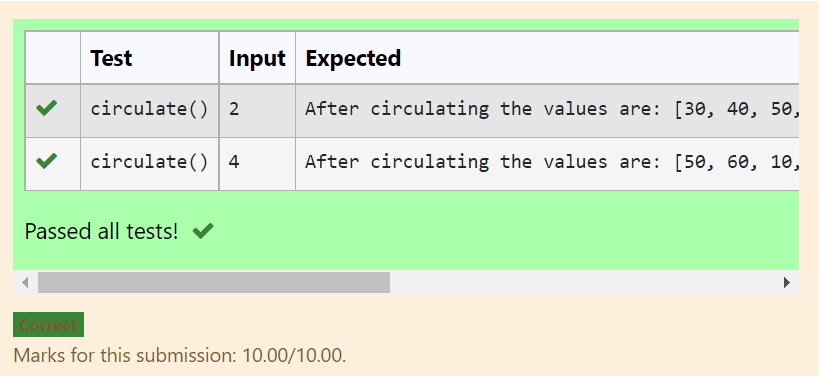

# Circulate-the-values-of-N-variables
## Aim:
To write a python program to circulate the n variables using function concept
## Equipment’s required:
PC
Anaconda - Python 3.7
## Algorithm: 
### Step 1: 
Get value from the user for calculation
### Step 2: 
Assign the values
### Step 3: 
Get the value from the user for the number of rotation
### Step 4: 
Using the slicing concept rotate the list

### Step 5: 
print both the values it would be circulated
### Step 6: 
end the program
## Program:
~~~
def circulate():
    n=int(input())
    l=[10,20,30,40,50,60]
    l=l[n:]+l[:n]
    print("After circulating the values are:",l)
~~~

## Output:

## Result:
thus circulate the n variables using function concept is successfully executed
